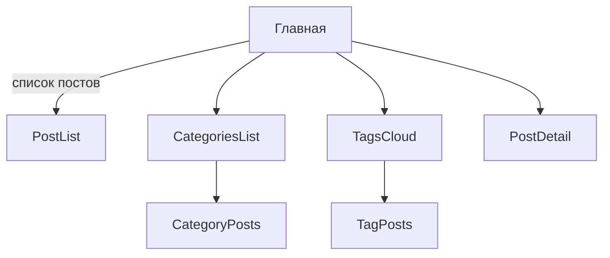

## 📚 О проекте

**exception_blog** — это обучающий блог о программировании на Django 5.2.  
Он демонстрирует практическую реализацию классического блога с использованием S3-хранилища, Markdown-контента и расширяемой архитектуры.

## 🗂️ Структура репозитория

```
exception_blog/        – конфигурация Django-проекта
├─ settings.py         – основные настройки [`exception_blog/settings.py`](exception_blog/settings.py:1)
├─ urls.py             – корневые маршруты [`exception_blog/urls.py`](exception_blog/urls.py:1)
├─ blog/               – Django-приложение «blog»
└─ ...
manage.py              – точка входа
README.md              – текущий файл
```

## 🏗️ Приложения 🚀

| app      | назначение                                                          | статус |
|----------|---------------------------------------------------------------------|--------|
| **blog** | основная логика блога (Post, Category, Tag)                         | ✅     |
| **users**| кастомная модель пользователя, OAuth (GitHub/VK), лайки, подписки   | 🔜     |

## 🧩 Модели данных

### Category 🗃️

| поле        | тип                       | описание                       |
|-------------|---------------------------|--------------------------------|
| id          | AutoField                | PK                             |
| name        | CharField(150)           | название                       |
| slug        | SlugField(unique)        | генерируется `unicode-slugify` |
| description | TextField(blank=True)    | описание до 1000 симв.         |
| icon        | CharField(50, blank=True)| имя иконки Bootstrap-icons     |
| created_at  | DateTime(auto_now_add)   |                                |

**Сортировка**: `name`.

### Tag 🏷️

| поле | тип                | описание |
|------|--------------------|----------|
| id   | AutoField          | PK       |
| name | CharField(100)     |          |
| slug | SlugField(unique)  |          |

### Post 📝

| поле             | тип                           | описание                                |
|------------------|-------------------------------|-----------------------------------------|
| id               | AutoField                     | PK                                      |
| title            | CharField(200)                |                                         |
| slug             | SlugField(unique)             |                                         |
| description      | CharField(300)                | краткое описание                        |
| markdown_content | TextField                     | исходный Markdown                       |
| html_content     | TextField                     | кеш HTML (генерируется при save)        |
| cover            | ImageField(null=True, blank=True) | путь в S3                           |
| status           | CharField(10, choices=Draft/Published) |                              |
| published_at     | DateTime(null=True, blank=True)|                                         |
| views            | PositiveInteger(default=0)    | счётчик просмотров                      |
| category         | ForeignKey → Category         |                                         |
| tags             | ManyToMany → Tag              |                                         |
| created_at       | DateTime(auto_now_add)        |                                         |
| updated_at       | DateTime(auto_now)            |                                         |

#### Поведение 🔄

- Метод `save()` выполняет конвертацию Markdown → HTML (lib [`markdown`](https://pypi.org/project/Markdown/)) только при изменении `markdown_content`.
- Счётчик `views` инкрементируется сервисом при каждом отображении детальной страницы.

## 🌐 URL-схема 🛣️



| путь                     | имя              | представление               |
|-------------------------|------------------|-----------------------------|
| `/`                     | blog:list        | ListView публикаций         |
| `/categories/`          | blog:categories  | список категорий            |
| `/categories/<slug>/`   | blog:category-detail | посты категории         |
| `/tags/`                | blog:tags        | облако тегов                |
| `/tags/<slug>/`         | blog:tag-detail  | посты по тегу               |
| `/<slug>/`              | blog:detail      | детальный пост              |

## 🖼️ Медиа и файловое хранилище 📦

### Технологии
- `django-storages` + `boto3` для работы с S3-совместимым хранилищем **Timeweb Cloud**
- Автоматическая генерация публичных URL, возможность подключения CDN

### Настройки (`settings.py`)
```python
DEFAULT_FILE_STORAGE = "storages.backends.s3boto3.S3Boto3Storage"
AWS_ACCESS_KEY_ID = env("S3_KEY")
AWS_SECRET_ACCESS_KEY = env("S3_SECRET")
AWS_STORAGE_BUCKET_NAME = env("S3_BUCKET")
AWS_S3_ENDPOINT_URL = "https://s3.timeweb.cloud"
AWS_S3_REGION_NAME = "ru-1"
AWS_QUERYSTRING_AUTH = False  # публичные URL без подписи
```

### Рабочий процесс
1. Загрузка файлов (изображения / видео / аудио) через Django-admin.
2. Копирование сформированной S3-ссылки.
3. Вставка ссылки в Markdown-контент поста:
   ```markdown
   
   ```

### Планы развития
- Интеграция WYSIWYG-редактора (TinyMCE/CKEditor) с прямым S3-аплоадом.
- Drag-and-Drop загрузка и автоматическое встраивание медиа.
- Генерация preview-картинок для видео.

## 🖌️ Шаблоны и инклюды 🧩

```
base.html
_menu.html
_post_card.html
list.html
detail.html
_comment.html
_comments_block.html
```

> Все шаблоны лежат **непосредственно в корне каталога `templates/`**, подпапки не используются.

### base.html  

| Блок `` | Назначение | Значение по умолчанию |
|--------------------|------------|-----------------------|
| `title`            | `<title>` вкладки браузера | «exception_blog» |
| `meta_description` | `<meta name="description">` | пусто |
| `meta_keywords`    | `<meta name="keywords">`    | пусто |
| `og_tags`          | OpenGraph / Twitter теги    | формируются из `title/description/cover` |
| `extra_css`        | подключение дополнительных CSS | — |
| `content`          | основной контент страницы  | — |
| `extra_js`         | дополнительные &laquo;head&raquo;-скрипты | — |
| `footer`           | подвал (copyright и др.)   | дефолтный footer |

Рекомендуемые OG-теги внутри `og_tags`:

```html
<meta property="og:type" content="article">
<meta property="og:title" content="{{ title }}">
<meta property="og:description" content="{{ meta_description }}">
<meta property="og:url" content="{{ request.build_absolute_uri }}">
<meta property="og:image" content="{{ cover_url|default:static('img/og-default.png') }}">
<meta property="og:image:width" content="1200">
<meta property="og:image:height" content="630">
<meta property="vk:image" content="{{ cover_url|default:static('img/vk-default.png') }}">
```

Такой набор обеспечивает корректное превью в Telegram, VK, Twitter.

### Перечень шаблонов  

| Файл               | Описание                                                                 |
|--------------------|--------------------------------------------------------------------------|
| `base.html`        | Базовый каркас, подключает Bootstrap 5 и иконки, содержит блоки (см. выше) |
| `_menu.html`       | Инклюд главного меню навигации                                           |
| `_post_card.html`  | Карточка поста (обложка + описание)                                      |
| `list.html`        | Список постов, рендерит `for post in posts include '_post_card.html'`    |
| `detail.html`      | Детальная страница поста, выводит `html_content`, включает комментарии   |
| `_comment.html`    | Один комментарий (аватар, автор, дата, текст)                           |
| `_comments_block.html` | Список комментариев + форма добавления                              |


## 🛠️ Зависимости 🧰

```toml
Django = "^5.2"
markdown = "^3.6"
django-storages = "^1.14"
boto3 = "^1.34"
unicode-slugify = "^0.5"
```

## 🚀 Локальный запуск 💡

```bash
poetry install
poetry run python manage.py migrate
poetry run python manage.py createsuperuser
poetry run python manage.py runserver
```

## 🔄 Дальнейшие планы 🗓️

- Расширить **users**-приложение: OAuth, лайки, подписки, Telegram-уведомления.  
- Перейти на интерактивный Markdown-редактор с автозагрузкой медиа.  
- Добавить статус `scheduled` и Celery-задачу (или Django Q2) публикации.  

---

© 2025 **exception_blog**