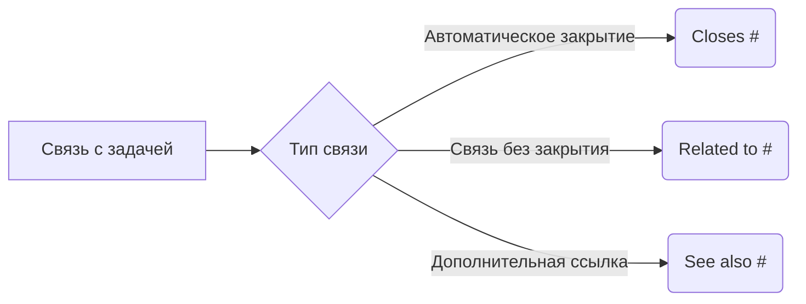
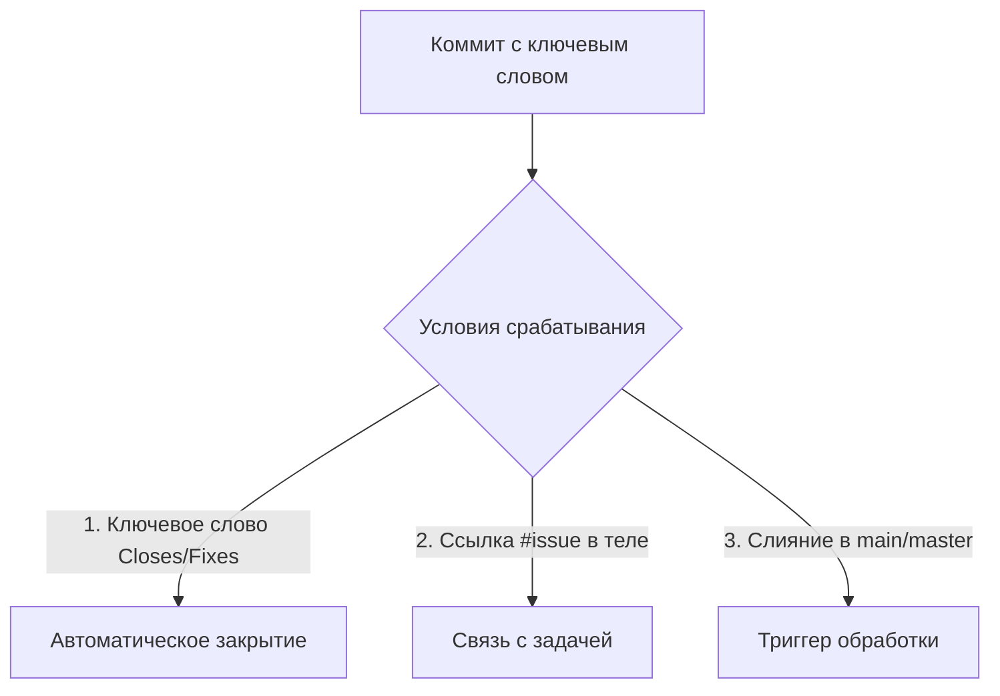

# Правила коммитов для exception_blog

## 1. Префиксы типов изменений
- `doc`: Изменения в документации
- `refactor`: Рефакторинг кода
- `fix`: Исправление ошибок
- `feat`: Новая функциональность
- `test`: Изменения тестов
- `config`: Настройки/конфигурация
- `deps`: Зависимости

## 2. Формат сообщения
```
<префикс>: <краткое описание> [эмодзи?]
```
Пример: `feat: Добавлена аутентификация через VK 🔐`

## 3. Тело коммита
- Тезисное перечисление изменений
- Каждый пункт с дефиса
- Маркдаун-форматирование
Пример:
```
doc: Обновление документации
- Добавлен раздел установки
- Описаны правила коммитов
- Обновлен pyproject.toml
```

## 4. Ключевые слова для задач


- **Closes #12**: Коммит решает задачу, автоматически закрывает issue
- **Related to #15**: Коммит связан с задачей, но не закрывает её
- **See also #7**: Дополнительная релевантная задача

## 5. Примеры использования

### Пример с Closes
```
fix: Исправление загрузки изображений
- Валидация MIME-типов
- Исправление таймаута S3
- Обработка ошибок подключения
Closes #18
```

### Пример с Related to
```
doc: Добавление CONTRIBUTING.md
- Правила кодстайла
- Процесс code review
- Инструкция по запуску тестов
Related to #23
```

## 6. Интеграция с GitHub


### Автоматическое закрытие задач
- Работает "из коробки" для публичных репозиториев
- Для приватных: убедитесь, что workflow разрешает автоматическое закрытие
- Поддерживаемые ключевые слова:
  - `Closes #123`
  - `Fixes #45`
  - `Resolves issue #67`

### Настройка
1. Для GitHub:
   - Требуется слияние в ветку по умолчанию (main/master)
   - Добавьте файл `.github/workflows/auto-close.yml` для кастомных сценариев

## 7. Рекомендации
1. Язык: русский
2. Длина заголовка: ≤50 символов
3. Тело: 3-5 пунктов для средних изменений
4. Ссылки на задачи в конце тела коммита