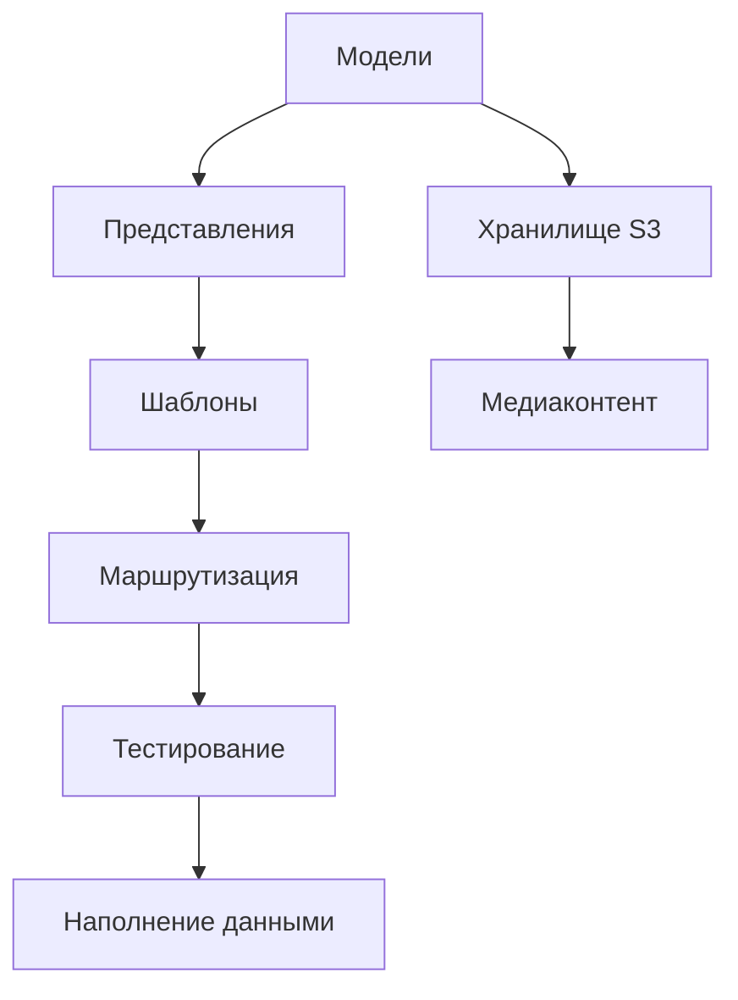

# 🗂️ Список задач проекта exception_blog

| Статус | Задача | Описание | Ссылка |
|--------|--------|-----------|--------|
| ❌ | 1. Создание приложения blog | Создать приложение blog и зарегистрировать его в проекте | [task_1.md](task_1.md) |
| ❌ | 2. Реализация моделей данных | Создать модели Category, Tag, Post | [task_2.md](task_2.md) |
| ❌ | 3. Настройка S3-хранилища | Настройка хранения медиафайлов в S3 (Timeweb Cloud) | [task_3.md](task_3.md) |
| ❌ | 4. Разработка шаблонов страниц | Создание HTML-шаблонов | [task_4.md](task_4.md) |
| ❌ | 5. Разработка представлений (Views) | Реализация CBV для отображения данных | [task_5.md](task_5.md) |
| ❌ | 6. Настройка маршрутизации (URLs) | Настройка URL-адресов | [task_6.md](task_6.md) |
| ❌ | 7. Тестирование и наполнение данными | Написание тестов и наполнение БД | [task_7.md](task_7.md) |

[Правила работы с задачами](task_rules.md)

## Архитектурный обзор и план реализации

### Ключевые компоненты системы


### Рабочий процесс реализации
1. **Инициализация приложения** (task_1)
   - Создание app `blog`
   - Регистрация в `settings.py`
   - Создание структуры директорий

2. **Модели данных** (task_2)
   - Реализация `Category`, `Tag`, `Post`
   - Автоматизация slug и Markdown-конвертации
   - Миграции БД

3. **S3-интеграция** (task_3)
   - Настройка Timeweb Cloud
   - Конфигурация `django-storages`
   - Работа с `.env` переменными

4. **Шаблоны** (task_4)
   - Базовый шаблон `base.html`
   - Компоненты: `_post_card`, `_comment`
   - Страницы: список постов, детали поста

5. **Представления** (task_5)
   - Класс-базированные views
   - Пагинация
   - Логика счетчика просмотров

6. **Маршрутизация** (task_6)
   - URL-паттерны
   - Пространство имен `blog`
   - Интеграция с корневым `urls.py`

7. **Тестирование** (task_7)
   - Юнит-тесты моделей и views
   - Наполнение тестовыми данными
   - Проверка всех сценариев

### Рекомендуемый порядок выполнения
```mermaid
gantt
    title План реализации
    dateFormat  YYYY-MM-DD
    section Базовый слой
    Приложение blog       :a1, 2025-06-21, 1d
    Модели данных         :a2, after a1, 2d
    S3-хранилище          :a3, after a2, 1d

    section Представление
    Шаблоны               :b1, after a3, 2d
    Views                 :b2, after b1, 2d
    Маршрутизация         :b3, after b2, 1d

    section Тестирование
    Тесты + данные        :c1, after b3, 2d